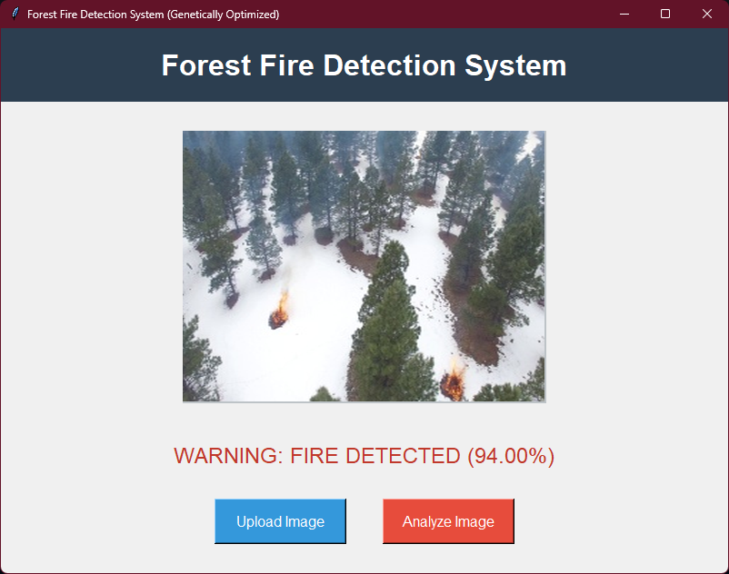
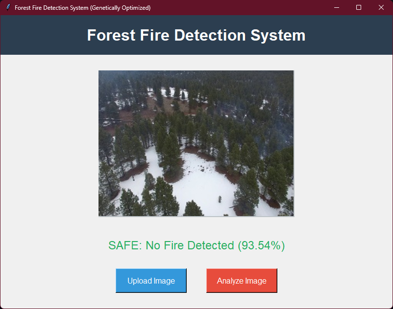

# Genetically Optimized Forest Fire Detection System

A Machine Learning pipeline that uses a custom Genetic Algorithm to optimize a Random Forest classifier for detecting forest fires in aerial imagery.

## Overview
Standard image classification models often rely on default or grid-searched hyperparameters. This project takes a hybrid approach. It utilizes a Genetic Algorithm (mimicking natural selection) to evolve and discover the optimal hyperparameter configuration specifically suited for the complex color and texture variances of forest fires. 

## System Demo

Here is the Graphical User Interface in action, demonstrating both positive detection and safe status.

### 🔴 Fire Detected

### 🟢 Safe Status

## Features
* **Custom Feature Extraction:** Converts raw images into HSV color space data and edge density metrics to isolate fire signatures from forest backgrounds.
* **Genetic Optimizer:** A from-scratch implementation of a Genetic Algorithm featuring tournament selection, single-point crossover, and mutation to tune the classifier.
* **Interactive GUI:** A Tkinter-based desktop application allowing users to upload a single image and receive real-time classification and confidence metrics.

## Tech Stack
* Python
* OpenCV (Image Processing)
* Scikit-Learn (Random Forest Classifier)
* Pandas & NumPy (Data Manipulation)
* Tkinter (Graphical Interface)

## How to Run
1. Clone the repository.
2. Ensure you have the required libraries installed (`pip install opencv-python scikit-learn pandas numpy pillow`).
3. Place your training images in a `dataset/` directory (categorized into `fire_images` and `non_fire_images`).
4. Run `extract_features.py` to generate the CSV data.
5. Run `ga.py` to train the model and generate the `.pkl` file.
6. Run `app.py` to launch the visual interface.